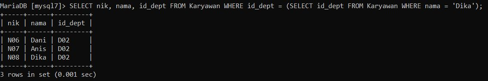
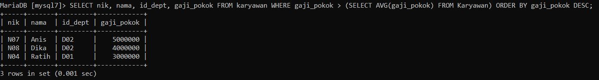
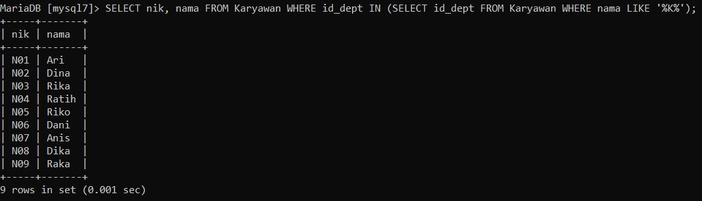
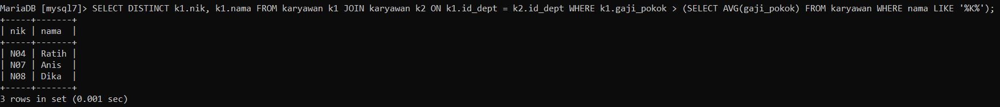

# Tugas Praktikum { Pertemuan ke 15 }


## Profil
| Variable | Isi |
| -------- | --- |
| **Nama** | Raditra Ikhwanul Arifin |
| **NIM** | 312310487 |
| **Kelas** | TI.23.A5 |
| **Mata Kuliah** | Basis data |


# Soal latihan praktikum 7

1. Tampilkan data karyawan yang bekerja pada departemen yang sama
dengan karyawan yang bernama Dika
2. Tampilkan data karyawan yang gajinya lebih besar dari rata-rata gaji semua
karyawan. urutkan menurun berdasarkan besaran gaji
3. Tampilkan nik dan nama karyawan untuk semua karyawan yang bekerja di
department yang sama dengan karyawan dengan nama yang mengandung
huruf 'K'.
4. Tampilkan data karyawan yang bekerja pada departemen yang ada di
kantor pusat.
5. Tampilkan nik dan nama karyawan untuk semua karyawan yang bekerja di
department yang sama dengan karyawan dengan nama yang mengandung
huruf 'K' dan yang gajinya lebih besar dari rata-rata gaji semua karyawan

### 1. Tampilkan data karyawan yang bekerja pada departemen yang sama dengan karyawan yang bernama Dika
**Script :**

```
SELECT nik, nama, id_dept FROM Karyawan WHERE id_dept = (SELECT id_dept FROM Karyawan WHERE nama = 'Dika');
```

**Output :**




### 2. Tampilkan data karyawan yang gajinya lebih besar dari rata-rata gaji semua karyawan. Urutkan menurun berdasarkan besaran gaji
**Script :**

```
SELECT nik, nama, id_dept, gaji_pokok FROM karyawan WHERE gaji_pokok > (SELECT AVG(gaji_pokok) FROM Karyawan) ORDER BY gaji_pokok DESC;
```

**Output :**




### 3. Tampilkan nik dan nama karyawan untuk semua karyawan yang bekerja di departmen yang sama dengan karyawan dengan nama yang mengandung huruf 'K'.
**Script :**

```
SELECT nik, nama FROM Karyawan WHERE id_dept IN (SELECT id_dept FROM Karyawan WHERE nama LIKE '%K%');
```

**Output :**




### 4. Tampilkan data karyawan yang bekerja pada departemen yang ada di Kantor pusat.
**Script :**

```
SELECT karyawan.nik, karyawan.nama, karyawan.id_dept FROM karyawan JOIN departemen ON karyawan.id_dept = departemen.id_dept WHERE departemen.id_p = 'P01';
```

**Output :**


### 5. Tampilkan nik dan nama karyawan untuk semua karyawan yang bekerja di departmen yang sama dengan karyawan dengan nama yang mengandung huruf 'K' dan yang gajinya lebih besar dari rata-rata gaji semua karyawan
**Script :**

```
SELECT DISTINCT k1.nik, k1.nama FROM karyawan k1 JOIN karyawan k2 ON k1.id_dept = k2.id_dept WHERE k1.gaji_pokok > (SELECT AVG(gaji_pokok) FROM karyawan WHERE nama LIKE '%K%');
```

**Output :**


